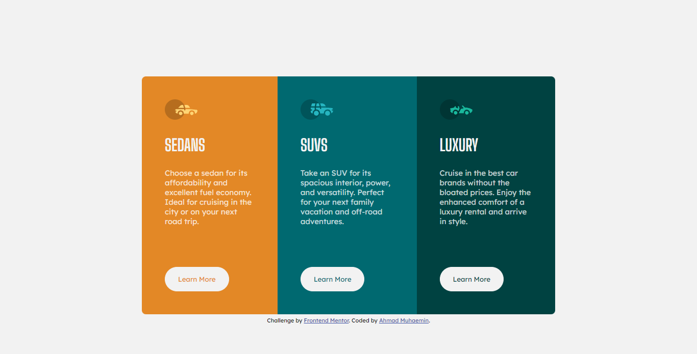
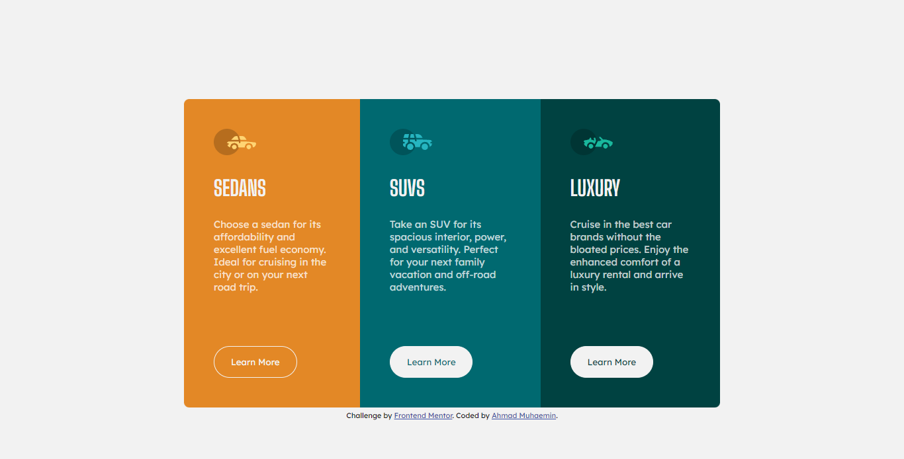
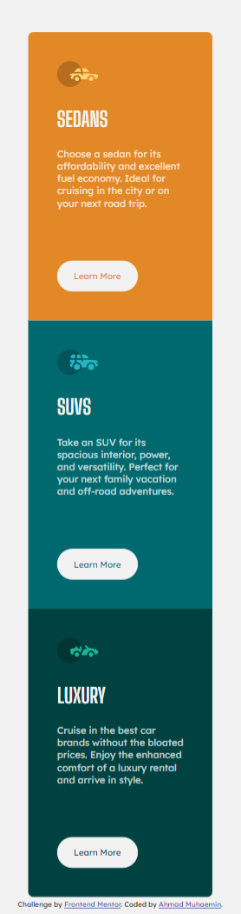

# Frontend Mentor - 3-column preview card component solution

This is a solution to the [3-column preview card component challenge on Frontend Mentor](https://www.frontendmentor.io/challenges/3column-preview-card-component-pH92eAR2-). Frontend Mentor challenges help you improve your coding skills by building realistic projects.

## Table of contents

- [Overview](#overview)
  - [The challenge](#the-challenge)
  - [Screenshot](#screenshot)
  - [Links](#links)
- [My process](#my-process)
  - [Built with](#built-with)
  - [What I learned](#what-i-learned)
  - [Continued development](#continued-development)
  - [Useful resources](#useful-resources)
- [Author](#author)

**Note: Delete this note and update the table of contents based on what sections you keep.**

## Overview

### The challenge

Users should be able to:

- View the optimal layout depending on their device's screen size
- See hover states for interactive elements

### Screenshot

- Desktop View
  

- Button Hover View
  

- Mobile View
  

### Links

- Solution URL: [Add solution URL here](https://your-solution-url.com)
- Live Site URL: [Add live site URL here](https://your-live-site-url.com)

## My process

### Built with

- Semantic HTML5 markup
- CSS custom properties
- Flexbox
- Mobile-first workflow

### What I learned

Accepting the challenge was a challenge on itself for me as a victim of the Tutorial Hell. Firstly, I read the README.md file thoroughly on what to do and how to do it, and in the end I did complete it.
What I learn is mostly to be brave and confidence on myself.

It is the first time I use custom properties in CSS :

```css
:root {
  --orange: hsl(31, 77%, 52%);
  --cyan: hsl(184, 100%, 22%);
  --dark-cyan: hsl(179, 100%, 13%);
  --trans-white: hsla(0, 0%, 100%, 0.75);
  --light-gray: hsl(0, 0%, 95%);
}
```

It is laughable because knowing is easy to do, for as long as I learned Web Development, I always avoided to use it.

I also try to use the <article>, and <section> tag to wrap the "text" part (I don't know is it the right thing to do, please do tell) to minimize the use of <div> as I always did.

### Continued development

Still looking for the most simple way to apply repeated CSS (in my case is for the button).

### Useful resources

- (https://developer.mozilla.org/en-US/docs/Web/CSS/Using_CSS_custom_properties) - This helped me understand what is custom properties on CSS and how to use it.

## Author

- Frontend Mentor - [@amuhaemin](https://www.frontendmentor.io/profile/amuhaemin)
- Instagram - [@amuhaemin](https://www.instagram.com/amuhaemin)
